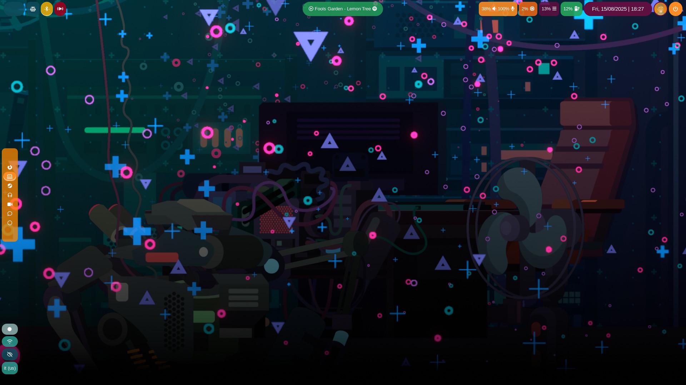

# Niri Config

Welcome to my niri configuration!

;

## Workspaces

Right now my configuration is composed of 6 base workspaces that should be enough
(maybe even too many):

- browser: mainly for the browser or low time consuming tasks;
- code: for coding and testing;
- steam: for playing games ( mainly steam ;) );
- audio: for audio related applications;
- video: for video related applications (may remove in the future);
- chat: for social apps such as discord or telegram;

## Keyboard

Currently I use the Italian layout with the US variant.
I have found it is more comfortable for me when programming as there is less 
reaching for the AltGr and Shift keys.

## Binds

Here are some custom binds that I have added on top of the base ones:

| binds | action | 
| ----- | ------ |
| Mod+Shift+Alt+Q | Shuts down the computer |
| Mod+KP_Right/6 | Plays next song on whichever music player[^1] |
| Mod+KP_Left/4 | Plays previous song on whichever music player[^1] |
| Mod+KP_Begin/5 | Plays/Stops current song on whichever music player[^1] |

I'm still getting used to environment, but probably bindings will change soon some more.

[^1]: Uses the `playerctl` utility.

## Miscellaneous

Also to get more control over the whole configuration I didn't rely too much on the 'spawn-on-startup' utility (even though is super cool) and I used 
[systemd to start the services parallel to niri](https://github.com/YaLTeR/niri/wiki/Example-systemd-Setup).

## Function Keys

I'm currently still in the process of thinking if and which function keys to bind.
On top of my laptop keyboard I use a Razer Chroma, therefore function keys differ from each other.

Since there is still no way to bind keys based on the input I have listed all function keys one under the other at the end of the binds section. 

I'm planning of binding the function keys based off of the laptop's ones, so it may be that some function keys will do something completely different from what they were planned to.

## Layout and Animations

My layout is minimal, nothing fancy cause I don't want many distractions. Due to this, I have also turned off most of the animation this amazing window manager offers.

---

The background picture is a steam wallpaper bought with steam points
